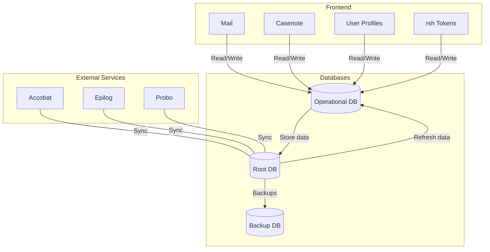

# Data Flow Diagram

```mermaid
graph TD
  subgraph Frontend
    F1[Mail]
    F2[Casenote]
    F3[User Profiles]
    F4[rsh Tokens]
  end

  subgraph Databases
    ODB[(Operational DB)]
    RDB[(Root DB)]
    BDB[(Backup DB)]
  end

  subgraph External Services
    S1[Accobat]
    S2[Epilog]
    S3[Probo]
  end

  F1 -->|Read/Write| ODB
  F2 -->|Read/Write| ODB
  F3 -->|Read/Write| ODB
  F4 -->|Read/Write| ODB

  ODB -->|Store data| RDB
  RDB -->|Refresh data| ODB

  S1 ---|Sync| RDB
  S2 ---|Sync| RDB
  S3 ---|Sync| RDB

  RDB -->|Backups| BDB
```
